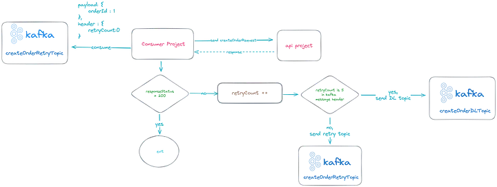

# Guide: Implementing Retry and Dead Letter Queue in Kafka

## Introduction
This guide will walk you through implementing a retry mechanism and a Dead Letter Queue (DLQ) in Kafka. These patterns are essential for handling message processing failures gracefully in distributed systems.

---

## Step 1: Customizing the Retry Count
By default, Kafka retries processing a message indefinitely, which can block subsequent messages. To avoid this, you can customize the retry behavior in a Spring Boot application.

### Configuration
Here’s how you can configure a maximum retry count:

```java
@Configuration
@EnableKafka
public class KafkaConfig {

  @Bean
  public ConcurrentKafkaListenerContainerFactory<?, ?> kafkaListenerContainerFactory(
      ConsumerFactory<Object, Object> consumerFactory) {

    ConcurrentKafkaListenerContainerFactory<Object, Object> factory = new ConcurrentKafkaListenerContainerFactory<>();
    factory.setConsumerFactory(consumerFactory);
    factory.setCommonErrorHandler(defaultErrorHandler());
    return factory;
  }

  @Bean
  public DefaultErrorHandler defaultErrorHandler() {
    // Retry 5 Times with 1000ms Intervals
    FixedBackOff fixedBackOff = new FixedBackOff(1000L, 5);
    return new DefaultErrorHandler((record, exception) -> {
      if (exception instanceof SerializationException) {
        System.err.println("Serialization exception for record: " + record);
      }
    }, fixedBackOff);
  }
}
```

This configuration retries a message 5 times with a 1-second interval between attempts. However, persistent issues may still lead to failures.

---

## Step 2: Using a Retry Topic
For persistent issues, you can use a Retry Topic. This allows the consumer to continue processing other messages while retrying problematic ones.

### Application Scenario
Imagine the following setup:


1. The Producer sends a message.
2. The Consumer processes the message and makes an API request.
3. If an error occurs, the message is sent to the Retry Topic.

### Implementation
```java
@Service
public class KafkaListenerExample {

  @KafkaListener(topics = "createOrder", groupId = "test_group_id")
  public void listenCreateOrder(String message) {
    try {
      sendApiRequest(message);
    } catch (Exception e) {
      sendRetryTopic(message);
    }
  }

  @KafkaListener(topics = "createOrderRetry", groupId = "test_group_id")
  public void listenCreateOrderRetry(String message) {
    sendApiRequest(message);
  }
}
```

Messages in the Retry Topic are retried until successful. If retries fail, the message is sent to the Dead Letter Queue.

---

## Step 3: Implementing a Dead Letter Queue
A Dead Letter Queue (DLQ) stores messages that fail processing after multiple retries. These messages can be logged, monitored, or stored for further analysis.

### Application Scenario
1. If the Consumer encounters an error, the message is sent to the Retry Topic.
2. The Retry Topic increments the retry count. If the count reaches the maximum, the message is sent to the DLQ.



3. A Consumer listens to the DLQ, logs the message, and stores it in a database.


### Implementation
```java
@Service
public class KafkaListenerExample {

  private int maxRetryCount = 5;

  @KafkaListener(topics = "createOrder", groupId = "test_group_id")
  public void listenCreateOrder(String message) {
    try {
      sendApiRequest(message);
    } catch (Exception e) {
      int retryCount = 0;
      sendRetryTopic(message, retryCount);
    }
  }

  @KafkaListener(topics = "createOrderRetry", groupId = "test_group_id")
  public void listenCreateOrderRetry(String message, @Header(name = "retryCount") Integer retryCount) {
    try {
      sendApiRequest(message);
    } catch (Exception e) {
      retryCount++;
      if (retryCount == maxRetryCount) {
        sendDlTopic(message);
        return;
      }
      sendRetryTopic(message, retryCount);
    }
  }

  @KafkaListener(topics = "createOrderDeadLetter", groupId = "test_group_id")
  public void listenCreateOrderDL(String message) {
    log.warning("New event received in DLQ: " + message);
    insertDb(message);
  }
}
```

---

## Beyond the Solution
To further improve this setup, consider delaying retries. For example, you can configure the Consumer to process messages every 5 minutes using a cron job.

This concludes the guide. With these patterns, you can handle message processing failures effectively in Kafka.
